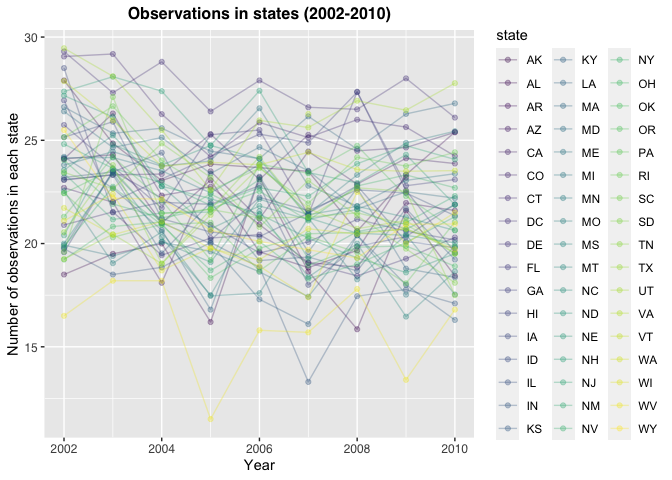
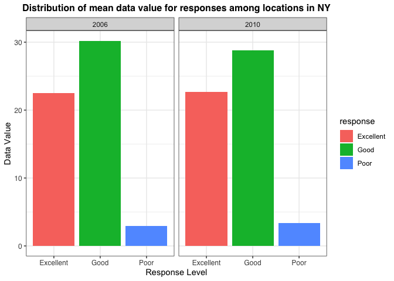

p8105\_hw3\_jys2136
================
Jocelyn Sun
10/14/2021

``` r
library(tidyverse)
library(p8105.datasets)
library(httr)
library(jsonlite)
```

# Problem 1

## Instacart Data

#### Most popular aisles and number of ordered items

``` r
data("instacart")

# Finding the number of aisles in instacart:
n_aisle = 
  instacart %>%
  count(aisle) %>%
  arrange(desc(n))


# Looking at the first few rows of data to see which aisles(s) are the most items ordered from:
head(n_aisle, 5)
```

    ## # A tibble: 5 × 2
    ##   aisle                           n
    ##   <chr>                       <int>
    ## 1 fresh vegetables           150609
    ## 2 fresh fruits               150473
    ## 3 packaged vegetables fruits  78493
    ## 4 yogurt                      55240
    ## 5 packaged cheese             41699

#### Data description

The data set ***instacart*** has has 15 variables and 1384617
observations.

There are 134 aisles and as we can see in the output provided above, the
aisles where the most items are ordered from are *fresh vegetables* and
*fresh fruits*, with 150609 number of items being ordered from *fresh
vegetables* and 150473 number of items being ordered from *fresh
fruits*.

#### Visualizing aisles with &gt; 10,000 items ordered

<!-- -->

The graph above shows the number of items ordered among aisles that have
over 10,000 items ordered, respectively. The frequency of ordered items
according to aisle category are ordered from least to greatest, left to
right. We can see that the most popular aisles are *fresh vegetables*
and *fresh fruits*. This is consistent with the findings in the section
on [Most popular aisles and number of ordered
items](#most-popular-aisles-and-number-of-ordered-items).

#### Visualizing the most popular items in the aisles “baking ingredients”, “dog food care”, and “packaged vegetables fruits”

| aisle              | product\_name                                   | frequency | product\_rank |
|:-------------------|:------------------------------------------------|----------:|--------------:|
| baking ingredients | light brown sugar                               |       157 |             1 |
| baking ingredients | pure baking soda                                |       140 |             2 |
| baking ingredients | organic vanilla extract                         |       122 |             3 |
| dog food care      | organix grain free chicken & vegetable dog food |        14 |             1 |
| dog food care      | organix chicken & brown rice recipe             |        13 |             2 |
| dog food care      | original dry dog                                |         9 |             3 |

**Table 1: Top three purchased items in aisles “baking ingredients” and
“dog food care”**

The table above shows the most popular items in the specified aisles
“baking ingredients”, *dog food care*, and *packaged vegetables fruits*.
In the ***instacart*** dataset, We can see that there is no data on
aisle *packaged vegetables fruits*. There is data on aisles *baking
ingredients* and *dog food care*. The most popular product in *baking
ingredients* is *light brown sugar*. The most popular product in *dog
food care* is *organix grain free chicken & vegetable dog food*.

#### Visualizing mean hour of orders for Pink Lady Apples and Coffee Ice Cream on each day of the week

| product\_name    | Friday | Monday | Saturday | Sunday | Thursday | Tuesday | Wednesday |
|:-----------------|-------:|-------:|---------:|-------:|---------:|--------:|----------:|
| coffee ice cream |  12.26 |  14.32 |    13.83 |  13.77 |    15.22 |   15.38 |     15.32 |
| pink lady apples |  12.78 |  11.36 |    11.94 |  13.44 |    11.55 |   11.70 |     14.25 |

**Table 2: Mean hour of orders for pink lady apples and coffee ice cream
on each day of the week**

# Problem 2

## Data for Behavioral Risk Factors Surveillance System for Selected Metropolitan Area Risk Trends (SMART) (2002-2010)

#### Cleaning the data:

``` r
data("brfss_smart2010") 

clean_brfss = 
  brfss_smart2010 %>%
  janitor::clean_names() %>%
  filter(topic == "Overall Health",
         response %in% c("Excellent", "Very Good", "Good", "Poor")) %>%
  mutate(response = factor(response, levels = c("Excellent", "Very Good", "Good", "Poor"))) %>%
  separate(locationdesc, c("state", "location", "rest")) %>%
  unite(location, c("location", "rest")) %>%
  arrange(response)
```

#### Which states were observed at 7 or more locations in 2002 & 2010

``` r
brfss_2002 = 
  clean_brfss %>%
  filter(year == "2002") %>%
  group_by(state) %>%
  distinct(location) %>% #unique() does not work here
  count(state) %>%
  rename("observations" = "n") %>%
  filter(observations > 6)

brfss_2010 = 
  clean_brfss %>%
  filter(year == "2010") %>%
  group_by(state) %>%
  distinct(location) %>% #unique() does not work here
  count(state) %>%
  rename("observations" = "n") %>%
  filter(observations > 6)

brfss_2002
```

    ## # A tibble: 6 × 2
    ## # Groups:   state [6]
    ##   state observations
    ##   <chr>        <int>
    ## 1 CT               7
    ## 2 FL               7
    ## 3 MA               8
    ## 4 NC               7
    ## 5 NJ               8
    ## 6 PA              10

``` r
brfss_2010
```

    ## # A tibble: 14 × 2
    ## # Groups:   state [14]
    ##    state observations
    ##    <chr>        <int>
    ##  1 CA              12
    ##  2 CO               7
    ##  3 FL              41
    ##  4 MA               9
    ##  5 MD              12
    ##  6 NC              12
    ##  7 NE              10
    ##  8 NJ              19
    ##  9 NY               9
    ## 10 OH               8
    ## 11 PA               7
    ## 12 SC               7
    ## 13 TX              16
    ## 14 WA              10

In 2002, the following states were observed at 7 or more locations:
**CT, FL, MA, NC, NJ, PA**.

In 2010, the following states were observed at 7 or more locations:
**CA, CO, FL, MA, MD, NC, NE, NJ, NY, OH, PA, SC, TX, WA**.

#### Constructing a spaghetti plot

<!-- -->

The plot above shows that the majority of states had more than 10
observed locations in during the years 2002 - 2010.

#### Comparing the distribution of mean data values between 2006 and 2010 within the state of NY

<!-- -->

# Problem 3

## Accelerometer Data

``` r
accel_df = read_csv("data/accel_data.csv")
```

    ## Rows: 35 Columns: 1443

    ## ── Column specification ────────────────────────────────────────────────────────
    ## Delimiter: ","
    ## chr    (1): day
    ## dbl (1442): week, day_id, activity.1, activity.2, activity.3, activity.4, ac...

    ## 
    ## ℹ Use `spec()` to retrieve the full column specification for this data.
    ## ℹ Specify the column types or set `show_col_types = FALSE` to quiet this message.
