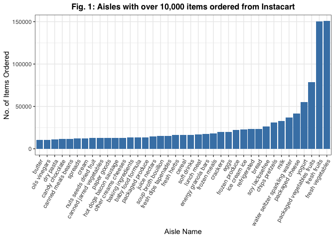

p8105\_hw3\_jys2136
================
Jocelyn Sun
10/14/2021

``` r
library(tidyverse)
library(p8105.datasets)
```

# Problem 1

## Instacart Data

#### Most popular aisles and number of ordered items

``` r
data("instacart")

# Finding the number of aisles in instacart:
n_aisle = 
  instacart %>%
  count(aisle) %>%
  arrange(desc(n))


# Looking at the first few rows of data to see which aisles(s) are the most items ordered from:
head(n_aisle, 5)
```

    ## # A tibble: 5 × 2
    ##   aisle                           n
    ##   <chr>                       <int>
    ## 1 fresh vegetables           150609
    ## 2 fresh fruits               150473
    ## 3 packaged vegetables fruits  78493
    ## 4 yogurt                      55240
    ## 5 packaged cheese             41699

#### Data description

The data set *instacart* has has 15 variables and 1384617 observations.

There are 134 aisles and as we can see in the output provided above, the
aisles where the most items are ordered from are “fresh vegetables” and
“fresh fruits”, with 150609 number of items being ordered from “fresh
vegetables” and 150473 number of items being ordered from “fresh
fruits”.

#### Visualizing aisles with &gt; 10,000 items ordered

<!-- -->

**need to add figure legend** The graph above shows the number of items
ordered among aisles that have over 10,000 items ordered, respectively.
The frequency of ordered items according to aisle category are ordered
from least to greatest, left to right. We can see that the most popular
aisles are “fresh vegetables” and “fresh fruits”. This is consistent
with the findings in the section on [Most popular aisles and number of
ordered items](#most-popular-aisles-and-number-of-ordered-items).

#### Visualizing the most popular items in the aisles “baking ingredients”, “dog food care”, and “packaged vegetables fruits”

| aisle              | product\_name                                   | frequency | product\_rank |
|:-------------------|:------------------------------------------------|----------:|--------------:|
| baking ingredients | Light Brown Sugar                               |       157 |             1 |
| baking ingredients | Pure Baking Soda                                |       140 |             2 |
| baking ingredients | Organic Vanilla Extract                         |       122 |             3 |
| dog food care      | Organix Grain Free Chicken & Vegetable Dog Food |        14 |             1 |
| dog food care      | Organix Chicken & Brown Rice Recipe             |        13 |             2 |
| dog food care      | Original Dry Dog                                |         9 |             3 |

**Table 1: Most popular items in the aisles “baking ingredients”, “dog
food care”, and “packaged vegetables fruits”**

The table above shows the most popular items in the specified aisles
“baking ingredients”, “dog food care”, and “packaged vegetables fruits”.
In the *instacart* dataset, We can see that there is no data on aisle
“packaged vegetables fruits”. There is data on aisles “baking
ingredients” and “dog food care”. The most popular product in “baking
ingredients” is light brown sugar. The most popular product in “dog food
care” is Organix grain free chicken & vegetable dog food.

Make a table showing the mean hour of the day at which Pink Lady Apples
and Coffee Ice Cream are ordered on each day of the week; format this
table for human readers (i.e. produce a 2 x 7 table). \#\#\#\#
Visualizing mean hour of orders for Pink Lady Apples and Coffee Ice
Cream on each day of the week
