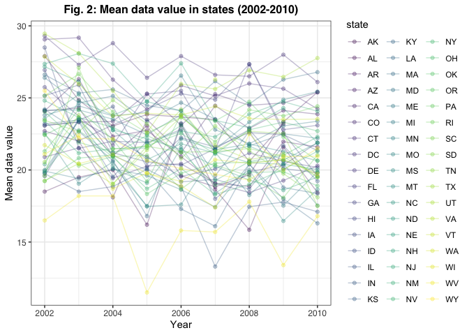
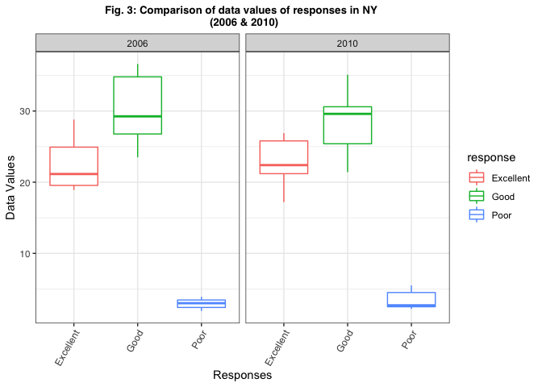

p8105\_hw3\_jys2136
================
Jocelyn Sun
10/14/2021

``` r
library(tidyverse)
library(p8105.datasets)
```

# Problem 1

## Instacart Data

#### Most popular aisles and number of ordered items

| aisle                      |   n    |
|:---------------------------|:------:|
| fresh vegetables           | 150609 |
| fresh fruits               | 150473 |
| packaged vegetables fruits | 78493  |
| yogurt                     | 55240  |
| packaged cheese            | 41699  |

#### Data description

The dataset **instacart** has has 15 variables and 1384617 observations.

There are 134 aisles and as we can see in the output provided above, the
aisles where the most items are ordered from are *fresh vegetables* and
*fresh fruits*, with 150609 number of items being ordered from *fresh
vegetables* and 150473 number of items being ordered from *fresh
fruits*.

#### Visualizing aisles with &gt; 10,000 items ordered

<!-- -->

The graph above shows the number of items ordered among aisles that have
over 10,000 items ordered, respectively. The frequency of ordered items
according to aisle category are ordered from least to greatest, left to
right. We can see that the most popular aisles are *fresh vegetables*
and *fresh fruits*. This is consistent with the findings in the section
on [Most popular aisles and number of ordered
items](#most-popular-aisles-and-number-of-ordered-items).

#### Visualizing the most popular items in the aisles “baking ingredients”, “dog food care”, and “packaged vegetables fruits”

| aisle                      | product\_name                                   | frequency | product\_rank |
|:---------------------------|:------------------------------------------------|----------:|--------------:|
| baking ingredients         | light brown sugar                               |       157 |             1 |
| baking ingredients         | pure baking soda                                |       140 |             2 |
| baking ingredients         | organic vanilla extract                         |       122 |             3 |
| dog food care              | organix grain free chicken & vegetable dog food |        14 |             1 |
| dog food care              | organix chicken & brown rice recipe             |        13 |             2 |
| dog food care              | original dry dog                                |         9 |             3 |
| packaged vegetables fruits | organic baby spinach                            |      3324 |             1 |
| packaged vegetables fruits | organic raspberries                             |      1920 |             2 |
| packaged vegetables fruits | organic blueberries                             |      1692 |             3 |

**Table 1: Top three purchased items in aisles “baking ingredients” and
“dog food care”**

The table above shows the most popular items in the specified aisles
***baking ingredients***, ***dog food care***, and ***packaged
vegetables fruits***. In the **instacart** dataset, the most popular
product in ***baking ingredients*** is *light brown sugar*. The most
popular product in ***dog food care*** is *organix grain free chicken &
vegetable dog food*, and the most popular product in ***packaged
vegetables fruits*** is *organic baby spinach*.

#### Visualizing mean hour of orders for Pink Lady Apples and Coffee Ice Cream on each day of the week

| product\_name    | Friday | Monday | Saturday | Sunday | Thursday | Tuesday | Wednesday |
|:-----------------|-------:|-------:|---------:|-------:|---------:|--------:|----------:|
| coffee ice cream |  12.26 |  14.32 |    13.83 |  13.77 |    15.22 |   15.38 |     15.32 |
| pink lady apples |  12.78 |  11.36 |    11.94 |  13.44 |    11.55 |   11.70 |     14.25 |

**Table 2: Mean hour of orders for pink lady apples and coffee ice cream
on each day of the week**

From the table above, we can generally conclude that *coffee ice cream*
tends to be ordered later in the day compared to orders of *pink lady
apples*. The only exception is Friday where we see that the orders for
either item come in around the same average time of the day.

# Problem 2

## Data for Behavioral Risk Factors Surveillance System for Selected Metropolitan Area Risk Trends (SMART) (2002-2010)

#### Cleaning the data:

``` r
data("brfss_smart2010") 

clean_brfss = 
  brfss_smart2010 %>%
  janitor::clean_names() %>%
  filter(topic == "Overall Health",
         response %in% c("Excellent", "Very Good", "Good", "Poor")) %>%
  mutate(response = factor(response, levels = c("Excellent", "Very Good", "Good", "Poor"))) %>%
  separate(locationdesc, c("state", "location", "rest")) %>%
  unite(location, c("location", "rest")) %>%
  arrange(response)
```

#### Which states were observed at 7 or more locations in 2002 & 2010

``` r
brfss_2002 = 
  clean_brfss %>%
  filter(year == "2002") %>%
  group_by(state) %>%
  distinct(location) %>% #unique() does not work here
  count(state) %>%
  rename("observations" = "n") %>%
  filter(observations > 6)

brfss_2010 = 
  clean_brfss %>%
  filter(year == "2010") %>%
  group_by(state) %>%
  distinct(location) %>% 
  count(state) %>%
  rename("observations" = "n") %>%
  filter(observations > 6)

knitr::kable(list(brfss_2002, brfss_2010), align = "cr", caption = "Table 3: States with observations at 7 or more locations 2002 (left) & 2010 (right)")
```

<table class="kable_wrapper">
<caption>
Table 3: States with observations at 7 or more locations 2002 (left) &
2010 (right)
</caption>
<tbody>
<tr>
<td>

| state | observations |
|:-----:|-------------:|
|  CT   |            7 |
|  FL   |            7 |
|  MA   |            8 |
|  NC   |            7 |
|  NJ   |            8 |
|  PA   |           10 |

</td>
<td>

| state | observations |
|:-----:|-------------:|
|  CA   |           12 |
|  CO   |            7 |
|  FL   |           41 |
|  MA   |            9 |
|  MD   |           12 |
|  NC   |           12 |
|  NE   |           10 |
|  NJ   |           19 |
|  NY   |            9 |
|  OH   |            8 |
|  PA   |            7 |
|  SC   |            7 |
|  TX   |           16 |
|  WA   |           10 |

</td>
</tr>
</tbody>
</table>

In 2002, the following states were observed at 7 or more locations:
**CT, FL, MA, NC, NJ, PA**.

In 2010, the following states were observed at 7 or more locations:
**CA, CO, FL, MA, MD, NC, NE, NJ, NY, OH, PA, SC, TX, WA**.

#### Constructing a spaghetti plot

<!-- -->

The plot above shows the mean data values for states that had excellent
responses over the years 2002 - 2010.

#### Comparing the mean data values between 2006 and 2010 within the state of NY

<!-- -->
Above is a comparison of the distribution of data values of responses
“Excellent” to “Poor” among locations in NY between the years 2006 and
2010.

# Problem 3

## Accelerometer Data

This dataset reflects five weeks of accelerometer data collected on a 63
year-old male with BMI 25, who was admitted to the Advanced Cardiac Care
Center of Columbia University Medical Center and diagnosed with
congestive heart failure (CHF).

#### Cleaning the data

``` r
clean_accel = 
  read_csv("data/accel_data.csv") %>% 
  pivot_longer(
    cols = activity.1:activity.1440,
    names_to = "minute",
    values_to = "activity_counts",
    names_prefix = "activity.") %>% 
  mutate(
    minute = as.numeric(minute),
    day = factor(day, levels = c("Monday", 
                                 "Tuesday", 
                                 "Wednesday",
                                 "Thursday", 
                                 "Friday", 
                                 "Saturday", 
                                 "Sunday")),
    weekend_indicator = (day == "Saturday" | day == "Sunday"))
```

The cleaned accelerator data set contains 50400 observations and 6
variables.

The variables record the following information for each observation: \*
`week` : the week count, a numeric vector \* `day_id`: the day count, a
numeric vector \* `day`: the day of the week, a factor vector with 7
levels associated with each day of the week \* `minute`: the minute of
activity, a numeric vector \* `activity_count`: the activity counts for
each minute of a 24-hour day starting at midnight, a numeric value \*
`weekend_indicator`: a weekend indicator, a logic vector (TRUE if a
weekend, FALSE if a weekday)

#### Total activity

| week |  Monday   | Tuesday  | Wednesday | Thursday |  Friday  | Saturday | Sunday |
|:----:|:---------:|:--------:|:---------:|:--------:|:--------:|:--------:|:------:|
|  1   | 78828.07  | 307094.2 |  340115   | 355923.6 | 480542.6 |  376254  | 631105 |
|  2   | 295431.00 | 423245.0 |  440962   | 474048.0 | 568839.0 |  607175  | 422018 |
|  3   | 685910.00 | 381507.0 |  468869   | 371230.0 | 467420.0 |  382928  | 467052 |
|  4   | 409450.00 | 319568.0 |  434460   | 340291.0 | 154049.0 |   1440   | 260617 |
|  5   | 389080.00 | 367824.0 |  445366   | 549658.0 | 620860.0 |   1440   | 138421 |

**Table 4: Total activity by day of the week**

#### Average activity with a day (24 hours)

    ## Warning: Continuous limits supplied to discrete scale.
    ## Did you mean `limits = factor(...)` or `scale_*_continuous()`?

<!-- -->
